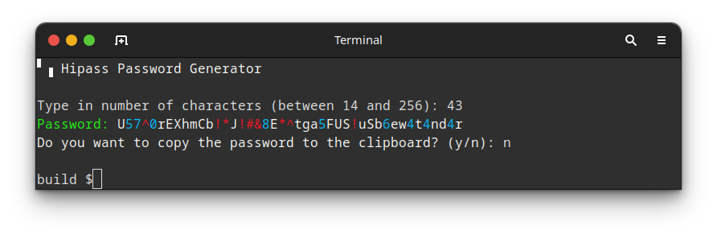

## Hipass Password Generator


Hipass is a CLI (Command Line Interface) Password Generator that generates random, strong passwords. 
The intent of the project is to generate passwords in a fast, concise way and copy them directly into the clipboard, without having 
to rely on internet services.

#### Why use a password generator?
Passwords must be strong and unique to each service you're using. This way, attackers will have a harder time guessing your passwords, or even 
<a href="https://www.fortinet.com/resources/cyberglossary/brute-force-attack">"brute forcing"</a> 
the services you can potentially have an account. By having strong and random passwords, it is less likely that an attacker can try combinations with information
they have about you, such as birth date, names of your family members or even the name of your dog. 

That's why password generators comes in handy. They can create strong, unique, random passwords each time they're prompted. 
They can output uppercase A-Z, lowercase a-z, special characters and numbers to be as random as possible so they are difficult for an attacker to remember,
as well as extremely difficult to brute force.

Since, according to NIST (as cited by Gary Orenstein, from Bitwarden) the 
<a href="https://bitwarden.com/blog/how-long-should-my-password-be/">
"Password length has been found to be a primary factor in characterizing password strength"
</a>
I've capped the minimum value of generating a password with a minimum of 14 characters length. 
With that, it's possible to generate password that would take at least a century to crack. 

#### Where should I store my passwords, then?
Password managers, period. Also, it's recommended that you keep a very strong password for that too, with a separate e-mail to login.
Usually a 2FA is also recommended for "further improvement on security", but for a password manager this is pratically mandatory for obvious reasons. 
You can use offline or online solutions for that. My top 3 recommendations are: 
<a href="https://bitwarden.com/">BitWarden</a>, <a href="https://usa.kaspersky.com/about/company">Kaspersky</a> and <a href="https://proton.me/pass">Proton Pass</a>.
Of course they also offer robust password generators, but if you want an offline, fast solution, you can recursively use 
<a href="https://github.com/lknknm/hipass-pass-gen">Hipass</a>.

### Documentation
- To see how to build the project, please take a look at the developer documentation and follow the [Build Manual](./doc/dev/BUILD.md). 
- To see how we style our code, please refer to the [Code Style Guide](./doc/dev/STYLEGUIDE.md)

### Usage
```
  ./hipass [--flag] [f]
```

```
  *no flags*        User will be prompted to choose character length of a random password with 
                    A-Z uppercase, a-z lowercase, numbers and special characters

The following arguments will generate passwords with the ones user had selected.
Example: ./hipass AZ num sym az

  AZ                Include A to Z uppercase characters
  az                Include a to z lowercase characters
  sym               Include special symbols (!@#^&*$)
  num               Include digits from 0 to 9

The following arguments can be passed as flags:  

  --h --help        Print out help text
  --v --version     Print version
       
  --prefix PREFIX      Generate password with a desired prefix
  --sufix SUFIX        Generate password with a desired sufix
  -p --passphrase 'sep'  Generate passphrase with a desired char separator and a random number in the end
```

#### For example:
```
hipass --passphrase '-'
```
Can output:
```
▘▗ Hipass Password Generator

Separator -
Type in number of words (between 3 and 20): 5
rollback-toothpicks-snowstorms-mercury-ledger-866

Do you want to copy the password to the clipboard? (y/n): y
Password copied to clipboard.
```

### Generating random characters
Generating random characters and random numbers based on a seed of time such as `srand(time(NULL))` and `rand()` may lead to several password exploits. A simple example of this is that seeding a `random` generator with `time(NULL)` and calling `generate_password` twice in `main()` will generate the same password twice. This means that seeding with `time(NULL)` will not generate milisecond time and will not use any kernel processes of the user's computer (adding solely GETPID in the equation won't help much either). Writing random number generators with specific design is a non-trivial task, being not only an exercise, but also a huge research topic on its own.

Initially, this password generator was using [this set of functions written](https://github.com/jleffler/soq/tree/6118083dc6af1daa0a0f0f54d6414f2f6c0e9049/src/so-7594-6155) by [Jonathan Leffler](https://github.com/jleffler). His random seed generation uses the widespread `/dev/random` and `/dev/urandom` devices as a [cryptographically secure pseudorandom number generator](https://en.wikipedia.org/wiki/Cryptographically_secure_pseudorandom_number_generator) with `rand48` seeding.

Although this solution was satisfactory enough for the scope of this project, C++ has more variety of random seed generation algorithms to choose from and consequently algorithms that have more bits of entropy and better uniform distributions, such as the mt19937. The stock `device` from the C++'s random library is known for not having the need of being non-deterministic (i.e. being truly random in runtime, as opposed from compile time, meaning it could generate the same number in every run for some systems). For the aforementioned reasons, this password generator uses the `randutils.hpp` C++ random number generator API by Melissa E. O'Neill, carefully explained in [her blog, pcg-random.org](https://www.pcg-random.org/posts/simple-portable-cpp-seed-entropy.html)

The random number generator is defined in the `rand.cpp` file, integrated with the C code via the C++ ABI (Application Binary Interface), called by the `generator.c` file:
```cpp
rand.cpp:
extern "C" 
{
	#include "clipboard.h"
    	//----------------------------------------------------------------------------
    	// Random number generator that implements the randutils auto_seed_256 seed engine.
    	// More information on the seed engine in
   	// https://www.pcg-random.org/posts/simple-portable-cpp-seed-entropy.html
	int random_nr(int min, int max) 
	{
		std::uniform_int_distribution dist{min, max};
		static std::mt19937           engine{randutils::auto_seed_256{}.base()};
		return dist(engine);
	}
}
```

- Further reading: https://www.pcg-random.org/

### Generating random passphrases
Generating passphrases is a great feature for password generators because they are hard enough for computers to guess (given it hass a significant amount of entropy), but easy for humans to remember or write. Passphrases are usually a set of "non-sensical" or "barely-sensical" words attached together by separators with the bonus of having a number somewhere.

To feed the "randomness" aspect of a passphrase, there are many wordlist dictionaries such as [the EFF wordlist](https://www.eff.org/deeplinks/2016/07/new-wordlists-random-passphrases) that contain rare words, nonsensical words and unusual names. Each word is picked using the diceware, meaning one can roll a dice six times to pick a random word from the list.

As imaginable, coming up with a wordlist is also a topic of study on its own, given wordlists usually include 7,000 to 40,000 words each, and may have different rulesets to make words possible to remember and yet difficult to crack. 


This passphrase generator uses the `sts10's ud2.txt wordlist`, "a [uniquely decodable list](https://github.com/sts10/generated-wordlists?tab=readme-ov-file#what-does-it-mean-if-a-list-is-uniquely-decodable), based on Google Ngram data and Niceware v. 4.0 list. It is free of some common homophones and British spellings of certain words". It was selected for this project because it has 40,000 uniquely decodable words, creating 15.288 bits of entropy per word. 

- Further reading:  
  - information on how to make a wordlist in [this post from sts10](https://sts10.github.io/2020/09/30/making-a-word-list.html).
  - sts10 methodology on wordlist generation [here](https://github.com/sts10/generated-wordlists).

Since this project is now using the C++ ABI, generating and allocating memory for a passphrase — in order to copy it to the clipboard — is easier than doing it manually in C, given we now have the `std::string` class to work with, therefore using the `append(str)` function to keep appending words and separators into the string and pass it as a `const char* password` to the clipboard.

```cpp
		// Select words from the dictionary using the random_nr(min, max) function and append to string.
		for (uint i = 0; i < wordcount; i++)
		{
			password.append(word[random_nr(0, 0xABCDEF) % word.size()]);
			password.append(sep);
		}
		password.append(number);
    ...
		copy_to_clipboard_prompt(password.c_str());
```

Further on, randomizing the selected wordlist dictionary for each word used in the passphrase generation could also make it more efficient against dictionary brute force attacks. This could be achieved by making a dictionaries index list and randomizing the index to select which dictionary will be loaded to pick a random word from. It is definately an insteresting exercise to understand if this would give more entropy for passphrase generation.

### Conclusion
Making an efficient random password/passphrase generator is not a very trivial task as it might seem if you care for security and true random number generators. Achieving true randomness to pick characters or words in a list is a difficult task that can be a topic of extensive research to understand different methods and behaviors for unpredictability, specially for password generation.

Hopefully, understanding such methods can be very beneficial in order to comprehend different tasks and applications they might be used, such as simulation and statistics. For the scope of this project I was only able to scratch the surface in this huge topic, but researching different libraries of PRNG and studying their intricacies was a very enriching experience.

### License
This project uses GNU GENERAL PUBLIC LICENSE 3.0.
